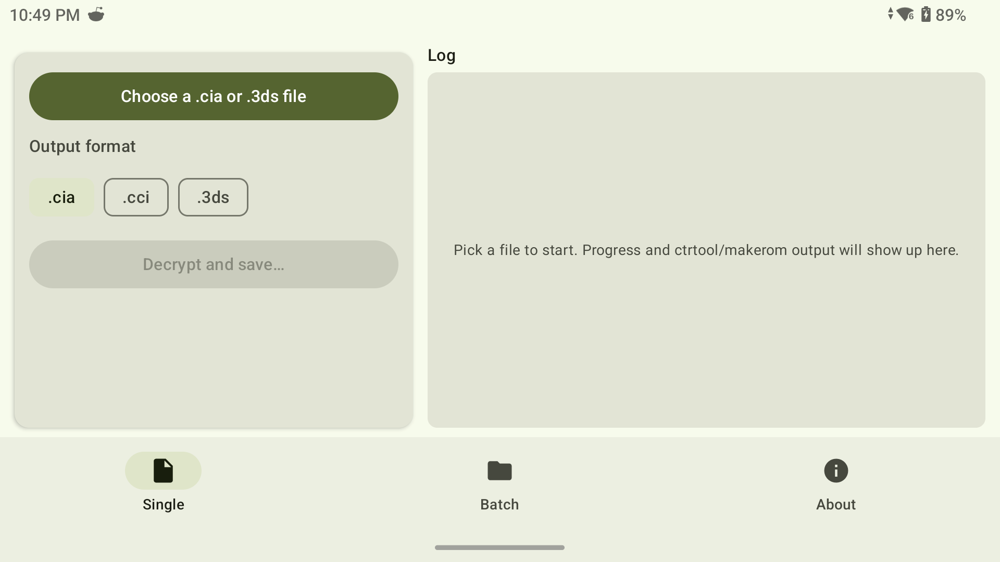
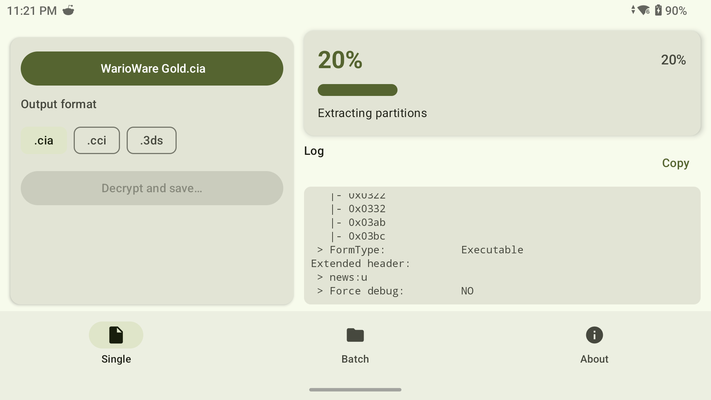
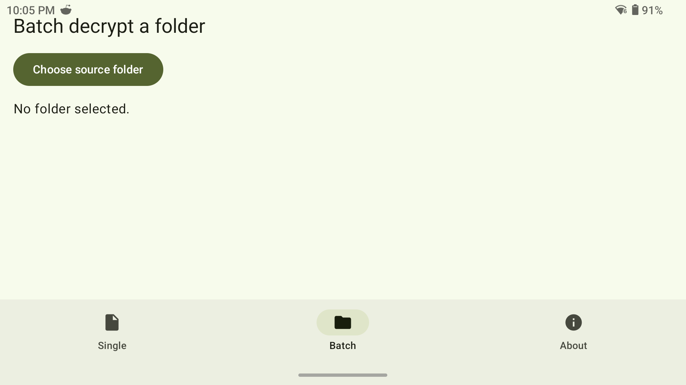

# cia3ds-android

On-device decryption of Nintendo 3DS `.cia` and `.3ds` files. Android port of
the Windows-only [Batch CIA 3DS Decryptor Redux][upstream].

Targets phones, tablets, Android TV, and ARM-handheld devices like the
Retroid Pocket and Odin. Output is a fully-decrypted `.cia` (or `.cci` for
games) that installs in any 3DS emulator that accepts plaintext content
(Citra, Lime3DS, [Azahar][azahar]).

## Screenshots

|                          Single, idle                          |                          Single, decrypting                          |                       Batch                        |
| :------------------------------------------------------------: | :------------------------------------------------------------------: | :------------------------------------------------: |
|  |  |  |

## Status

Actively in early development. Core pipeline (ctrtool extract → NCCH-flags
patch → makerom rebuild) is implemented in native code. UI scaffolding,
SAF-based file picking, and a foreground service for batch jobs are wired
up. 

## Build

Requirements:

- Android Studio Hedgehog (or newer) with NDK `28.2.13676358` and
  CMake `3.22.1` installed via the SDK manager
- JDK 17

```sh
git clone --recurse-submodules https://github.com/YOU/cia3ds-android.git
cd cia3ds-android
./gradlew :app:assembleDebug
```

The first build pulls and compiles `ctrtool`, `makerom`, mbedTLS, libfmt,
libyaml, libblz, libtoolchain, libnintendo-n3ds, and libbroadon-es from
vendored sources under `native/third_party/Project_CTR/`. Expect 5–10
minutes on first build per ABI; subsequent builds are incremental.

The output APK is at `app/build/outputs/apk/debug/app-debug.apk`. Sideload
with `adb install` or transfer to the device manually.

## Usage

1. Open the app, **Single** tab.
2. Tap *Choose a .cia or .3ds file* and pick a file from device storage,
   `/sdcard/Download`, an SD card, etc.
3. (Optional) Toggle *Convert to .cci* for cleaner emulator imports of
   eShop/cartridge games.
4. Tap *Save decrypted file*, choose a destination, then *Decrypt*.

Batch mode lives in the **Batch** tab: pick a folder, the app finds all
`.cia`/`.3ds` files inside, then writes a sibling `Decrypted/` directory
under the same tree. The job runs in a foreground service so it survives
backgrounding.

### Android TV / handhelds

The app declares `android.intent.category.LEANBACK_LAUNCHER` and ships a TV
banner, so it shows up on the Android TV home screen. D-pad navigation
works through the stock Compose Material focus model. SAF pickers are the
same as on phones, so most TV remotes will need a connected USB/BT mouse or
gamepad with a directional pad to operate them comfortably.

## Architecture

```
+--------------------------------------------------------+
| Kotlin (Jetpack Compose, Material 3)                   |
|   • SAF pickers, batch service, TV-friendly UI         |
+--------------------------+-----------------------------+
                           | JNI
+--------------------------v-----------------------------+
| libcia3ds.so   (one shared lib, 3 ABIs)                |
|   • ctrtool: NCCH/CIA decryption (MIT)                 |
|   • makerom: CIA/CCI rebuild (MIT)                     |
|   • mbedTLS: AES-CTR / SHA / RSA (Apache-2.0)          |
|   • libfmt, libyaml, libblz, libtoolchain, n3ds-libs   |
|   • ncch_flags.c: replaces closed-source decrypt.exe   |
+--------------------------------------------------------+
                           |
                  assets/seeddb.bin
```

`ncch_flags.c` is the open-source replacement for the closed-source
`decrypt.exe` that the original Windows tool shipped. It does one thing:
flips the `OtherFlag.NoEncryption` bit in each extracted NCCH partition
header, so emulators install the result without ever consulting an AES key.
See the file's header comment for the exact byte offsets, sourced from
[`ntd::n3ds::NcchCommonHeader`][n3ds-header] in the upstream
`libnintendo-n3ds` headers.

## License

MIT, see [LICENSE](LICENSE). Third-party attributions in [NOTICE](NOTICE).

[upstream]: https://github.com/xxmichibxx/Batch-CIA-3DS-Decryptor-Redux
[azahar]: https://github.com/azahar-emu/azahar
[n3ds-header]: native/third_party/Project_CTR/ctrtool/deps/libnintendo-n3ds/include/ntd/n3ds/ncch.h
